# GitHub Profile Banner Studio

Handcrafted, dynamic SVG vector banners for your GitHub Profile README.

## Features

- **1-Click Profile Importer**: Auto-fetch profile metadata, bio, avatar, and Profile `README.md` details (quotes, focus, tech stack).
- **5 Architectures**: Bento Grid, Sci-Fi HUD, Terminal Split, VS Code IDE, Retro Synthwave.
- **5 Dark Themes**: Nordic Slate, Titanium Zinc, Forest Emerald, Monokai Warm, Midnight Obsidian.
- **Dynamic Skills**: Renders 100% of selected tech skills with flex wrapping.
- **Serverless API**: Includes `api/banner.js` for dynamic Vercel image links.

## Quick Start

```bash
npm install
npm run dev
npm run build
```

## Usage

1. Open the studio UI (`http://localhost:5173/`).
2. Import your profile or customize details.
3. Click **Download SVG** and add it to your profile repository:

```html

```

## License

[MIT](LICENSE) © [Leander Antony](https://github.com/Leander-Antony)
